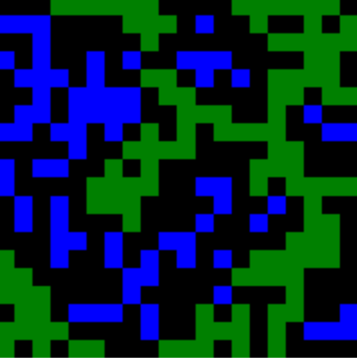
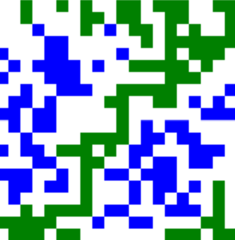

### Percolation threshold visualisation 

A project that visualises percolation through a 2D grid.

<picture>
  <source media="(prefers-color-scheme: dark)" srcset="./images/percolationanimationDark.png">
  <source media="(prefers-color-scheme: light)" srcset="./images/percolationanimationLight.png">


</picture>


### Setup 

```bash 
# Install dependencies
npm install 

# Compile to Javascript
npx tsc
```

### Features 

- [x] Basic visualisation 

UI

- [ ] Custom settings
    - [ ] Choose number of trials 
    - [ ] Change grid size 
    - [ ] Change size of each site 
- [ ] Invert colours
- [ ] Revert to previous positions 
- [x] Option to run simulations in parallel or in sequence.
- [x] Add option to randomise settings
- [x] Add presets
- [x] Congifure simulation speed
- [ ] Fix backfill problem 

Statistics 

- [x] Add statistics for the percolation threshold 
- [x] Mean threshold
- [x] Standard deviation for the threshold 
- [x] Have multiple instances of the percolation grid and perform many Monte Carlo simulations to estimate the percolation threshold. 

### Learning goals 

- [x] Union Find data structure 
- [x] Canvas API 
- [x] Sequencing animations with delays between them by using the Async/Await syntax and setTimeout. 
- [x] Opportunity to try out Typescript


